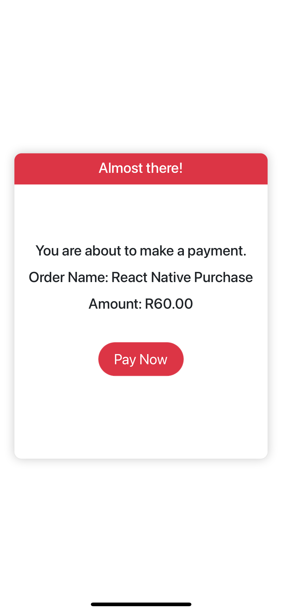
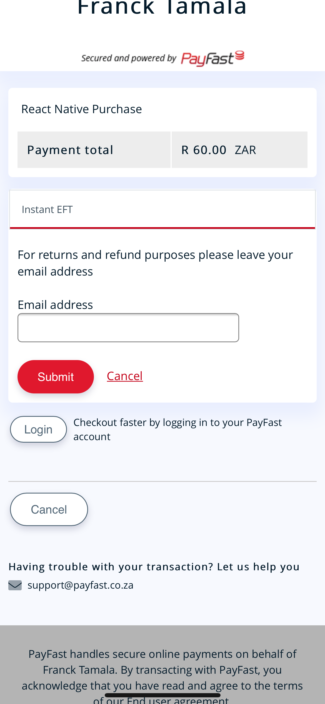
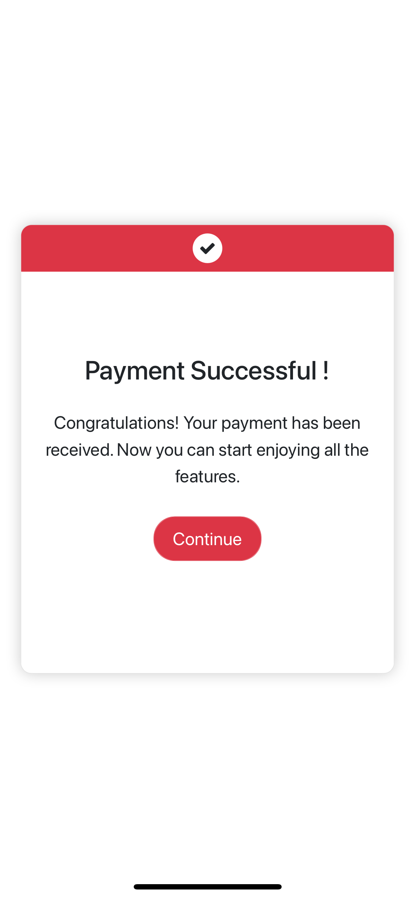

# React Native Payfast Gateway
A react native component to integrate with PayFast via a webview/API calls.

Check out the [PayFast documentation](https://developers.payfast.co.za/documentation) for more information on the payload and signature usage.

 &nbsp;&nbsp;
 &nbsp;&nbsp;
 &nbsp;&nbsp;


## Note
This libraty was inspired from Danie-ZA's Library [React-native-payfast](https://github.com/Danie-ZA/react-native-payfast)

## Installation

`npm install react-native-payfast-gateway`

OR

`yarn add react-native-payfast-gateway`

## Usage
1. Import the `PayFastWebView` component.

```js
import {PayFastWebView} from "react-native-payfast-gateway";
```

2. Assign a JSON object of payment data to the `data` prop of the component. Note the naming conventions of the fields as per the official [PayFast documentation](https://developers.payfast.co.za/documentation/#checkout-page).
```js
const styles = StyleSheet.create({
  container: {
    flex: 1,
    alignItems: 'center',
    justifyContent: 'center',
    marginTop: 20
  },
  btnWrapper: {
    width: "100%",
    flex: 1,
    alignItems: 'center',
    justifyContent: 'center',
  },
  btn: {
    margin: 10
  }
});

export default function App() {

  const [success, setSuccess] = useState(false)
  const [modalVisible, setModalVisible] = useState(false);
  const [paymentData, setPaymentData] = useState({});

  let onceOffPayment = {
    merchant_id : "10000100",
    merchant_key: '46f0cd694581a',
    amount: "60.00",
    item_name: 'React Native Purchase'
  }

  let subscription = {
    subscription_type: 1,
    recurring_amount: "200.00",
    frequency: 3,
    cycles: 0
  }

  function handleOnceOffPayment() {
    setPaymentData(onceOffPayment);
    setModalVisible(true);
  }

  function handleSubscriptionPayment() {
    setPaymentData({ ...onceOffPayment, ...subscription });
    setModalVisible(true);
  }

  return (
    <View style={styles.container}>

      <View style={styles.btnWrapper}>
        <View style={styles.btn}>
          <Button title="Once-Off Payment" onPress={() => handleOnceOffPayment()} />
        </View>
        <View style={styles.btn}>
          <Button title="Subscription" onPress={() => handleSubscriptionPayment()} />
        </View>
      </View>


      <Modal
        animationType="slide"
        transparent={true}
        visible={modalVisible}
        onRequestClose={() => {
          setModalVisible(!modalVisible);
        }}
      >
        <PayFastWebView sandbox={true} onClick={() => setModalVisible(false)} callback={setSuccess} signature={true} data={paymentData} />
      </Modal>
    </View>
  );
}
```

## Component Props
| Prop name | Type | Description | Example |
| ------------- |:-------| :-------------| :-------|
| data      | JSON | The payment data as per the [PayFast documentation](https://developers.payfast.co.za/documentation/#checkout-page). | `{merchant_id : 10000100,merchant_key: '46f0cd694581a',amount: 60.00,item_name: 'React Native Purchase'}` 
| sandbox   | Boolean | Set the component to redirect to the PayFast sandbox environment for test payments | `sandbox={true}` |
| signature | Boolean | An optional security measure to prevent man in the middle attacks. Note - you must have a passphrase set on your PayFast account | `signature={true}` |
| passphrase | String | The passphrase set on your PayFast/Sandbox account for use in conjunction with the signature generation | `passphrase={"passphrase"}` |
| callback | function | A function that handle the response. The response is `True` if the payment was successful and `False` otherwise | `callback={setSuccess}` |
| onClick | function | The action that happens when the user clicks on the button on the successful or unsuccessful page | `onClick={() => setModalVisible(false)}` |
| style | object | Pass in custom styles to the component to make the look and feel match for the app. All `values` are strings except ``showLogo`` | `style={{            headText: "You almost there!", headTextColor: "black", headBackground: "#fff", bodyBackground: "white", bodyTextColor: "#16003B", showLogo: true,  pageBackground: "black", }}`
